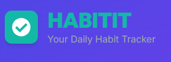

# HABITIT - Your Personal Habit Tracking Companion

<p align="center">
  
</p>

## Overview

HABITIT is a comprehensive, feature-rich habit tracking application designed to help you build and maintain positive habits. With its intuitive interface, customizable dashboard, and insightful analytics, HABITIT makes tracking your daily routines effortless and motivating.

Unlike other habit trackers, HABITIT focuses on user privacy by storing all your data locally on your device, ensuring that your personal information and habit data never leave your control.

## Table of Contents

- [Features](#features)
  - [Dashboard](#dashboard)
  - [Habit Management](#habit-management)
  - [Analytics](#analytics)
  - [Customization](#customization)
  - [Data Management](#data-management)
- [Getting Started](#getting-started)
  - [Installation](#installation)
  - [Initial Setup](#initial-setup)
- [User Guide](#user-guide)
  - [Creating Your First Habit](#creating-your-first-habit)
  - [Tracking Your Progress](#tracking-your-progress)
  - [Using Analytics](#using-analytics)
  - [Customizing Your Experience](#customizing-your-experience)
- [Technical Information](#technical-information)
  - [Local Storage](#local-storage)
  - [Technology Stack](#technology-stack)
- [Privacy and Security](#privacy-and-security)
- [Future Roadmap](#future-roadmap)
- [License](#license)

## Features

### Dashboard

The HABITIT dashboard serves as your central command center for habit tracking:

- **Daily Overview**: See all your habits for the day at a glance
- **Progress Tracking**: Visual indicators show your completion status
- **Streaks**: Track consecutive days of habit completion
- **Quick Actions**: Complete, edit, or view details with a single click
- **Responsive Design**: Works beautifully on any device from mobile to desktop
- **Dark/Light Modes**: Choose the theme that's easiest on your eyes

### Habit Management

HABITIT offers flexible options for creating and managing habits:

- **Multiple Categories**: Organize habits by health, productivity, learning, mindfulness, finance, social, or custom categories
- **Frequency Options**: Set habits as daily, weekly, or custom recurring schedules
- **Count or Completion**: Track habits by simple completion or with countable metrics (e.g., glasses of water, pages read)
- **Color Coding**: Assign colors to habits for quick visual identification
- **Icons**: Choose from a variety of icons to represent your habits
- **Descriptions**: Add detailed notes about your habits for motivation and clarity
- **Reminders**: Set optional time-based reminders for habit completion

### Analytics

Gain deeper insights into your habit performance with comprehensive analytics:

- **Completion Rates**: See percentage of habits completed over time
- **Streaks Analysis**: Track your longest streaks and current streak status
- **Consistency Scores**: Measure how consistent you've been with each habit
- **Time Analysis**: Discover what times of day you're most productive
- **Category Distribution**: Visualize the balance of habits across categories
- **Calendar Views**: See your habit completion patterns on daily, weekly, monthly and yearly calendars
- **Habit Correlation**: Discover which habits tend to be completed together
- **Custom Date Ranges**: Analyze your performance over specific periods

### Customization

HABITIT adapts to your personal preferences:

- **Widget Dashboard**: Arrange, resize, and customize analytics widgets
- **Background Themes**: Choose from 7 different background styles
  - Default
  - Gradient
  - Waves
  - Confetti
  - Dots
  - Geometric
  - Circuit
- **Theme Modes**: Toggle between light and dark modes
- **Widget Visibility**: Show or hide specific analytics widgets
- **Dashboard Layout**: Pin important widgets to the top of your dashboard

### Data Management

Keep control of your data with powerful management features:

- **Local Storage**: All data stored securely on your device
- **Data Export**: Export your habit data and settings as JSON for backup
- **Data Import**: Restore from previous backups
- **Data Privacy**: No account creation or cloud storage required

## Getting Started

### Installation

1. Clone the repository:
   ```
   git clone https://github.com/ckrstars/habititt.git
   ```

2. Install dependencies:
   ```
   cd habitit
   npm install
   ```

3. Start the development server:
   ```
   npm start
   ```

4. For production build:
   ```
   npm run build
   ```

### Initial Setup

When you first launch HABITIT, you'll see an empty dashboard ready for your habits. You can:

1. Click the "+" button to add your first habit
2. Use the theme toggle in the top right to switch between light and dark modes
3. Visit the Settings page to customize your experience
4. Start tracking your first habit right away!

## User Guide

### Creating Your First Habit

1. From the Dashboard, click the "+" button
2. Enter a name for your habit
3. Select an icon and color
4. Choose a category (health, productivity, etc.)
5. Set the frequency (daily, weekly, etc.)
6. Choose between completion or count tracking
7. Optionally set reminders
8. Add a description if desired
9. Click "Create Habit"

### Tracking Your Progress

1. From the Dashboard, click the checkbox or increment button next to any habit to mark it as complete
2. Your streak will automatically update
3. View detailed history by clicking on any habit
4. Undo accidental completions from the habit detail view
5. See your daily progress at the top of the Dashboard

### Using Analytics

1. Navigate to the Analytics page from the main navigation
2. Select a date range to analyze
3. Choose specific habits or view all habits
4. Rearrange widgets by dragging and dropping them
5. Resize widgets using the controls in the top-right corner of each widget
6. Pin important widgets to the top of your dashboard
7. Add new widgets with the "+" button at the bottom of the screen

### Customizing Your Experience

1. Navigate to the Settings page
2. Toggle between light and dark themes
3. Choose a background theme
4. Configure which widgets appear on your Analytics dashboard
5. Adjust notification preferences
6. Export or import your data
7. Reset habits if needed

## Technical Information

### Local Storage

HABITIT uses browser local storage to maintain your data:

- **habit-storage**: Stores your habit definitions and history
- **theme**: Remembers your theme preference (light/dark/custom)
- **widgets**: Keeps track of your Analytics dashboard configuration
- **backgroundTheme**: Saves your selected background theme
- **notifications**: Tracks your notification preferences

All data remains on your device and persists between sessions.

### Technology Stack

HABITIT is built with modern web technologies:

- **React**: For the user interface and component structure
- **TypeScript**: For type safety and better development experience
- **Tailwind CSS**: For responsive, utility-first styling
- **Zustand**: For state management
- **Framer Motion**: For smooth animations and transitions
- **React Beautiful DnD**: For drag-and-drop interfaces
- **React Icons**: For a comprehensive icon library
- **Canvas Confetti**: For celebration animations

## Privacy and Security

HABITIT prioritizes your privacy:

- **No Accounts**: No user registration or login required
- **No Cloud Storage**: All data stays on your device
- **No Tracking**: No analytics or user tracking implemented
- **No Network Requests**: App runs entirely client-side

## Future Roadmap

Planned features for future releases:

- **Habit Templates**: Quick-start templates for common habit categories
- **Social Sharing**: Optional sharing of achievements on social media
- **Advanced Statistics**: More in-depth analysis of habit patterns
- **Multiple Profiles**: Support for tracking habits for different users
- **Habit Groups**: Group related habits together
- **Progressive Web App**: Installable on mobile devices
- **Cross-Device Sync**: Optional encrypted sync between devices

## License

This project is licensed under the Apache License 2.0 - see the [LICENSE](LICENSE) file for details.

---

HABITIT is designed and developed with ❤️ to help you build better habits and improve your daily life.

© 2025 HABITIT 